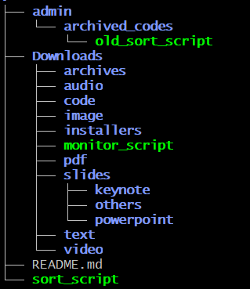

# DLORG Nike Törnros

## Short introduction
Welcome! I have created a bash-based organization system that automatically sorts files in a simulated 'Downloads' folder on a computer. Link to **[video explanation](https://youtu.be/utH0eO-a2L0)**.

## Script functions
`sort_script` creates relevant directories and moves files into their corresponding directories based on file extensions, such as ".pdf". File prefix can also be used for further organization, such as "contract_".

**Note**: Files must be present in `dlorg_nike_tornros/Downloads` in order to be affected by `sort_script`.

`monitor_script` monitors our `Downloads/` directory. Whenever a file enters this directory, `sort_script` is automatically triggered. Automatically launches on startup and continously runs as a service.

`ignore.gitignore` makes Git ignore irrelevant files, such as Vim's `.swp` files.

## Structure

- "Downloaded" (created) files end up in `~/Documents/github/dlorg_nike_tornros/Downloads/`, simulating a downloads folder on a computer.
- *An older, archived, iteration of `sort_script` can be found in `admin/archived_codes`*.

With all relevant directories in use, the structure will look like this:

## How it works

1. `monitor_script` launches when computer boots. If a file is moved into, or created in, `Downloads`, `sort_script` gets triggered.

2. `sort_script` creates directories, if any are missing or **have been deleted**.

3.
a) `sort_script` checks the files in the `Downloads/` directory and determines which directory each file belongs in based on its **file extension**. For example:
- *.tixt, *.md, *.rtf --> `Downloads/text`
- *.mov, *.mp4, *.mkv, *.avi --> `Downloads/video`

b) Some directories contain subdirectories. For example, files belonging in the umbrella-directory`Downloads/slides` are further organized based on their file type, `/slides/powerpoint`, `/slides/keynote` and `/slides/others`. This was done in order to showcase the script working with subdirectories.

- *.pptx --> `Downloads/slides/powerpoint`
- *.key --> `Downloads/slides/keynote`

c) Files can also be moved into subdirectories based on prefix, for example:
- contract_*.pdf --> `Downloads/pdf/contracts`

## Manual execution vs Automatic service

`sort_script` can be run manually simply by executing the script, `monitor_script` is used to make it an automatic service. See video explanation for a walktrough.

Automation will not be set up by downloading the repo, it must be done for each machine. 

To set up automation, run the following prompts one by one:

    `sudo dnf install inotify-tools`
    `mkdir -p ~/.config/systemd/user ~/.local/bin`
    `cp systemd/monitor_script.service ~/.config/systemd/user/`
    `ln -s "$PWD/monitor_script" ~/.local/bin/monitor_script`
    `systemctl --user daemon-reload`
    `systemctl --user enable --now monitor_script.service`

#### Stop / start:

Stop until reboot:
    `systemctl --user stop monitor_script.service`

Stop and disable auto-start after machine reboot:
    `systemctl --user disable --now monitor_script.service`

Start:
    `systemctl --user start monitor_script.service`
